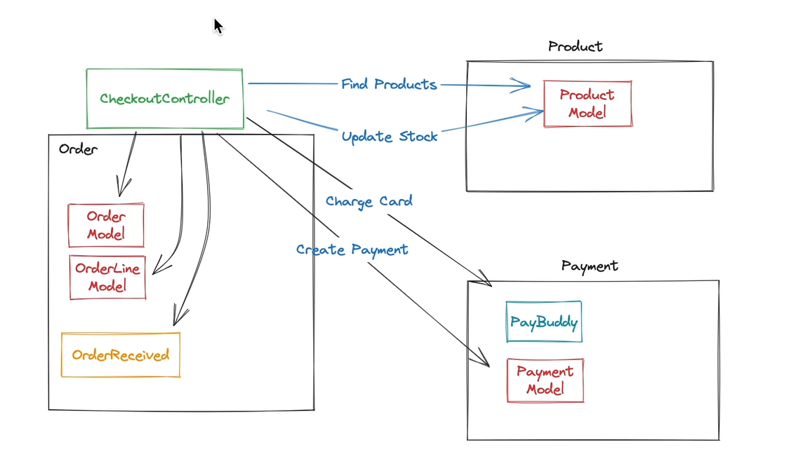
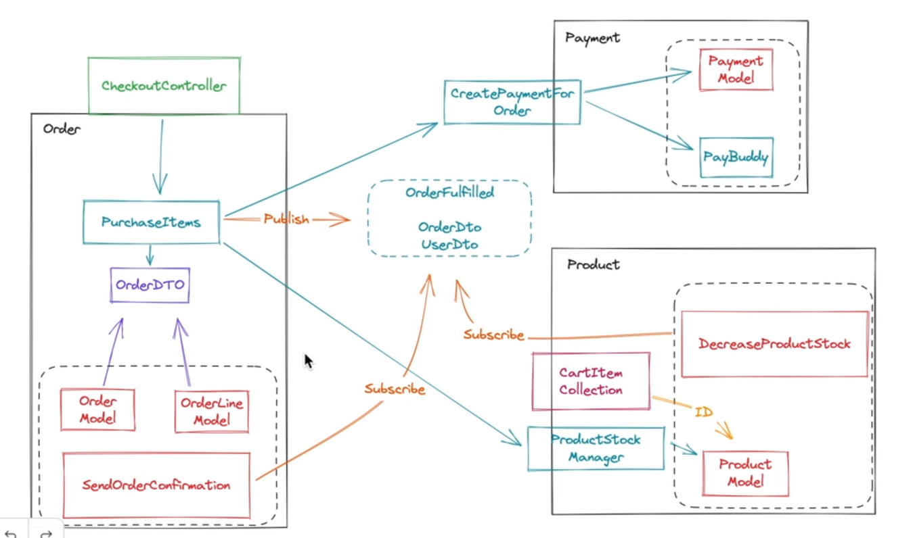
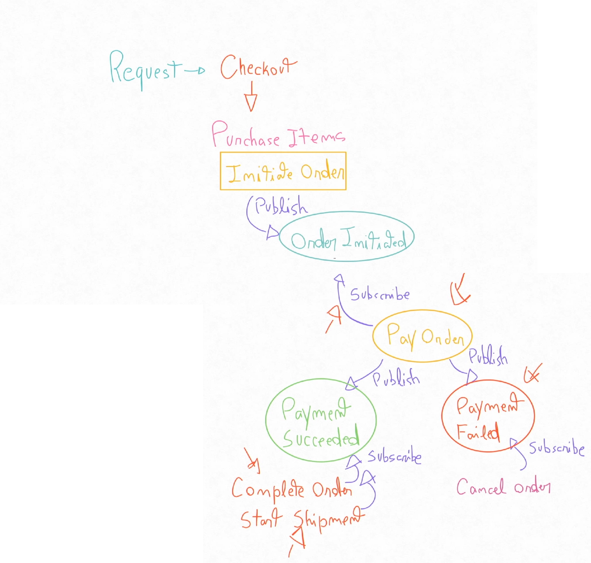

# Laravel application as a Modular Monolith

E-commerce example.

Services:
- postgresql
- valkey

Ideally, each module should be independent and loosely coupled. 

Here's how things started:

Here's how things ended up after an initial refactor

And then after even more decoupling by using events

